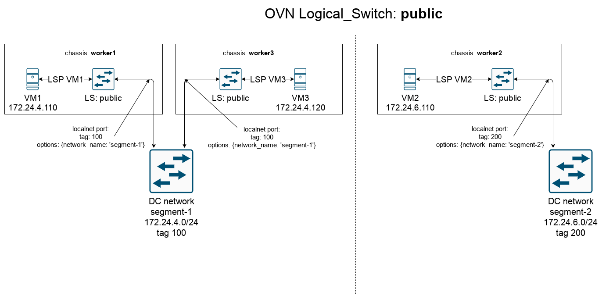

OVN Neutron Routed Provider Networks Scenario
=============================================

----------
 Scenario
----------

This scenario deploys Opentack cloud with OVN on multiple nodes and configures segmented provider network between them.
In OVN the segments are represented by connected localnet ports to one and the same logical switch: *public*.
There is a limitation, that only one chassis (compute) can be connected to only one provider network.

Overall system diagram:

.. image:: images/1.png

Logical diagram with OVN elements:

Segments
--------

In Neutron database there is one provider network created - *public* - with two segments:
 * *segment-1*, vlan: 100, cidr: 172.24.4.0/24
 * *segment-2*, vlan: 200, cidr: 172.24.6.0/24

Recipe how to use segmented networks in Neutron:
https://docs.openstack.org/neutron/pike/admin/config-routed-networks.html

List of hosts created
---------------------

================ ========================== ========================= ===================================
hostname         segment                    address                   info
---------------- -------------------------- ------------------------- -----------------------------------
central          not in any segment         ---                       central devstack and ovn host
worker1          segment-1                  172.24.4.10               compute in segment-1
worker2          segment-2                  172.24.6.10               compute in segment-2
worker3          segment-1                  172.24.4.11               compute in segment-1
host1            segment-1                  172.24.4.14               standalone workstation in segment-1
host2            segment-2                  172.24.6.14               standalone workstation in segment-2
================ ========================== ========================= ===================================

List of VMs created
-------------------

================ ========================== ========================= ===================================
hostname         segment                    address                   info
---------------- -------------------------- ------------------------- -----------------------------------
vm1              segment-1                  172.24.4.110              VM on worker1 (segment-1)
vm2              segment-2                  172.24.6.110              VM on worker2 (segment-2)
vm3              segment-1                  172.24.4.120              VM on worker3 (segment-1)
================ ========================== ========================= ===================================

Prerequirements
----------------
Boot Ubuntu 18.04 host with kvm virtualization support.
Minimum 100 GB disk, 16 GB ram.

How to
------

#. Install vagrant::

   $ sudo apt-get update
   $ sudo apt-get install vagrant libvirt-bin -y
   $ sudo vagrant plugin install vagrant-libvirt

#. Clone this repository::

   $ git clone https://github.com/mjozefcz/vagrants/
   $ cd ~/vagrants/ovn-routed-provider-networks-devstack

#. Spawn all instances::

   $ sudo vagrant up --no-provision

#. Wait until central gets up and then continue with other hosts::

   $ sudo vagrant provision central

#. Continue provisioning of other hosts::

   $ for host in worker1 worker2 worker3 host1 host2; do sudo vagrant provision ${host}; done

#. Cleanup default Neutron resources created by devstack and add multi segmented public network::

   $ sudo vagrant ssh central
   $ /vagrant/configure-segmented-network-resources.sh

#. Play::

   $ ping...
